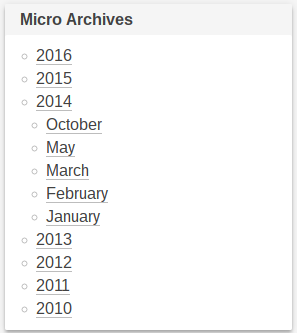

# Micro Archive Widget
* Contributors: marochk1n
* Donate link: http://donate.ziggi.org/
* Tags: archive, widget
* Requires at least: 3.0.1
* Tested up to: 4.7
* Stable tag: 1.0
* License: CC0 1.0
* License URI: https://creativecommons.org/publicdomain/zero/1.0/

# Description

Micro Archive Widget recreates the stock archive widget, but this time around the widget is laid out as an accordion. It gives you the years of the archive, and then when the year is clicked it expands to show the months. Widget is very small and simple, and he works without jQuery.

Development can be tracked at https://github.com/ziggi/micro-archive-widget

# Installation

1. Upload the micro-archive-widget folder to /wp-content/plugins
2. Activate the plugin
3. Add the widget to your widget area

# Frequently Asked Questions

## Is this widget show post count?

No, because it used stock archive widget.

## Where can I see this in action?

I've put this widget at the sidebar of my website. You can check it out at http://ziggi.org/

# Screenshot

1. This is an image of the accordion expanded revealing the months.

# Changelog

## 1.0
* Initial Release.

# Upgrade Notice

## 1.0
* No upgrade notices.
